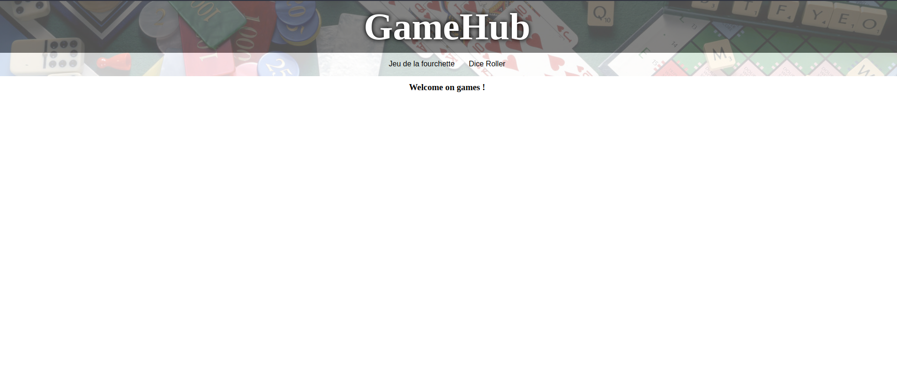
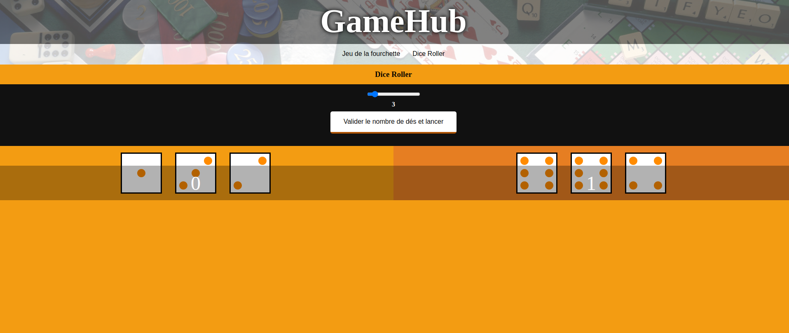

# GameHub

## Langages et technos

- HTML5, CSS3
- Javascript
- nodejs
- express
- ejs

## Installation

- git clone le repo : git@github.com:florine89/plateforme-games.git
- ouvrir sa console : npm install
- lancer le serveur : nodemon

